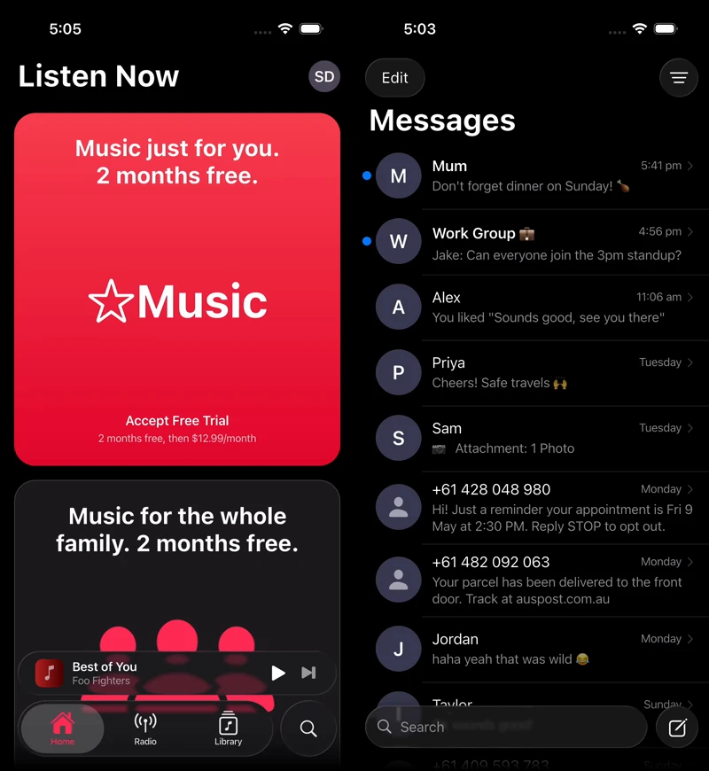
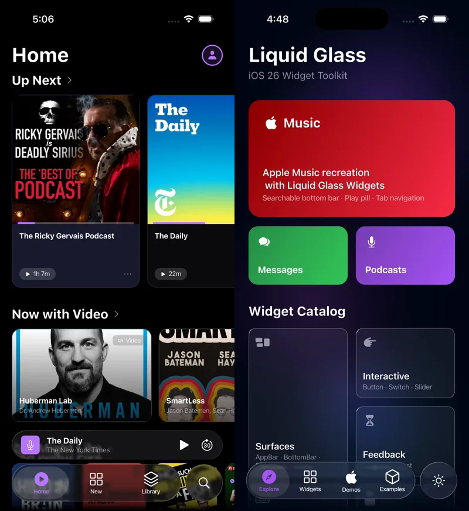

<div align="center">

# Liquid Glass Widgets

Bring Apple's iOS 26 Liquid Glass to your Flutter app — real shader-based blur, physics-driven jelly animations, and dynamic lighting across every platform.

[](https://pub.dev/packages/liquid_glass_widgets)
[](https://pub.dev/packages/liquid_glass_widgets/score)
[](https://pub.dev/packages/liquid_glass_widgets/score)
[](https://github.com/sdegenaar/liquid_glass_widgets/actions/workflows/ci.yml)
[](https://codecov.io/gh/sdegenaar/liquid_glass_widgets)
[](https://opensource.org/licenses/MIT)

<br>



<br>



</div>


## Installation

```yaml
dependencies:
  liquid_glass_widgets: ^0.30.2
```

```bash
flutter pub get
```

> **Flutter version requirement:** Requires Flutter ≥ 3.41.0 (Dart ≥ 3.5.0).
> **Recommended: Flutter 3.41+** for the best Impeller rendering quality.
> This package uses cutting-edge shader APIs that improve significantly with each Flutter release.


## Quick Start

Two steps — that's the entire setup:

**Step 1.** Call `initialize()` in `main()` to pre-warm shaders.

**Step 2.** Wrap your app with `LiquidGlassWidgets.wrap()`:

```dart
import 'package:flutter/material.dart';
import 'package:liquid_glass_widgets/liquid_glass_widgets.dart';

void main() async {
  WidgetsFlutterBinding.ensureInitialized();
  await LiquidGlassWidgets.initialize();

  runApp(LiquidGlassWidgets.wrap(child: const MyApp()));
}
```

`initialize()` performs **100% non-blocking async disk-to-RAM I/O** — zero GPU draw calls, zero rasterization — so the OS window always presents immediately. On Android, iOS, and macOS, all premium shaders are preloaded at startup for instant Frame 1 rendering. Advanced control:

```dart
// Default: automatically preloads all shaders on Android, iOS, macOS;
// skips unused premium shaders on Windows, Linux, and Web.
await LiquidGlassWidgets.initialize();

// Advanced: override the preloading strategy.
await LiquidGlassWidgets.initialize(
  warmUpMode: GlassWarmUpMode.auto,   // default — smart per-platform preload
  // warmUpMode: GlassWarmUpMode.always, // force all shaders on all platforms
  // warmUpMode: GlassWarmUpMode.never,  // skip heavy shader preload entirely
  enablePerformanceMonitor: false,    // suppress debug raster monitor (default: true)
);
```

> **Using `MaterialApp`?** Add one line so glass widgets honour your `ThemeMode` instead of the raw OS brightness:
> ```dart
> runApp(LiquidGlassWidgets.wrap(
>   child: const MyApp(),
>   brightnessResolver: Theme.maybeBrightnessOf, // ← required for MaterialApp
> ));
> ```
> Without this, shadows and borders can disappear when the device is in Dark Mode even if your app is set to Light Mode (and vice-versa). `CupertinoApp` users can omit it.

That's it. Then use `GlassScaffold` on each screen — it handles background, status bar, z-ordering, and edge fading automatically:

```dart
GlassScaffold(
  background: Image.asset('assets/wallpaper.jpg', fit: BoxFit.cover),
  statusBarStyle: GlassStatusBarStyle.auto,
  appBar: GlassAppBar(title: const Text('My App')),
  body: Center(child: GlassCard(child: Text('Hello, Glass!'))),
)
```

> **Why `GlassScaffold`?** Glass effects refract and blur against whatever is behind them. Without a controlled background, glass surfaces can appear flat, incorrectly tinted, or invisible. `GlassScaffold` wires up the background source, glass rendering layer, and bar isolation automatically — one widget instead of five.

> **Accessibility is on by default.** The library automatically reads the
> device's Reduce Motion and Reduce Transparency settings — no extra setup
> required. See [Accessibility](#accessibility) for details.

### Choose the right widget

The package is centred around **navigation chrome** — `GlassScaffold` with `GlassAppBar` and `GlassTabBar` is the primary pattern and where the iOS 26 liquid glass effect is most impactful.

| Scenario | Widget to use |
|---|---|
| Screen with app bar and/or tab bar | **`GlassScaffold`** — the primary pattern |
| Custom layout without standard scaffold structure | **`GlassPage`** — lower-level building block |
| Standalone glass card or panel in an existing layout | **`GlassCard` / `GlassContainer`** — opt-in, not the core pattern |
| Localised group of glass elements in an existing layout | **`AdaptiveLiquidGlassLayer`** — scope a layer to a region; grouped cards share its settings |

> `GlassContainer` / `GlassCard` are fully supported for localised glass UI (floating panels, settings cards, etc.) but most screens should start with `GlassScaffold`.

### Optional: quality & theming

For production apps, pass `adaptiveQuality` and/or `theme` to `wrap()` at the same call site:

```dart
runApp(LiquidGlassWidgets.wrap(
  child: const MyApp(),
  brightnessResolver: Theme.maybeBrightnessOf, // MaterialApp users: required
  adaptiveQuality: true,          // auto-benchmarks device, degrades gracefully
  theme: GlassThemeData.simple(   // optional app-wide glass defaults
    blur: 10,
    thickness: 30,
    quality: GlassQuality.standard,
  ),
));
```

Both parameters are optional — omit them and the library uses sensible defaults.


## Features

- **Comprehensive glass widget library** — containers, interactive controls, inputs, feedback, overlays, and navigation surfaces (see [Widget Categories](#widget-categories))
- **Liquid Morph Engine** — a standalone physics system powering iOS 26-style liquid morphing. `GlassMenu` is the first consumer; future widgets will use the same engine for consistent liquid transitions. See [`docs/LIQUID_MORPH_ENGINE.md`](docs/LIQUID_MORPH_ENGINE.md)
- **Real frosted glass** — native two-pass Gaussian blur + shader refraction on Impeller; lightweight shader on Skia/Web
- **Just works everywhere** — iOS, Android, macOS, Web, Windows, Linux; rendering path chosen automatically
- **Adaptive quality** *(experimental)* — `GlassAdaptiveScope` benchmarks the device at startup and adjusts quality in real time: `minimal` on slow hardware, `standard` on mid-range, `premium` on fast devices. Degrades on thermal throttle, recovers when cool
- **Minimal dependencies** — only `equatable`, `flutter_shaders`, and `logging` beyond the Flutter SDK
- **One-line setup** — `LiquidGlassWidgets.wrap(child: myApp)` handles accessibility bridging, adaptive quality, and global theming; use `GlassScaffold` per screen for automatic backdrop isolation, z-ordering, edge fading, and status bar styling
- **Content-aware brightness** — glass bars automatically flip between light and dark icons/labels based on the content scrolling behind them. One flag on `GlassScaffold`, matches iOS 26 behaviour
- **Gyroscope lighting** — `GlassMotionScope` drives specular highlights from any `Stream<double>`
- **WCAG-compliant by default** — Reduce Motion and Reduce Transparency are respected automatically; no setup required
- **Full keyboard & screen reader support** — every interactive widget supports Tab navigation, Space/Enter activation, and VoiceOver/TalkBack semantics out of the box; focus is visualised with an iOS 26-style outset ring
- **Full RTL (Right-to-Left) support** — layouts, drag directions, tab ordering, and physics auto-reverse for Arabic, Hebrew, and Persian


## Glass vs Content — Design Philosophy

In iOS 26, **glass is reserved for the navigation and control layer** — the
floating UI that sits above your app's content. Content areas (lists, cards,
article tiles) stay opaque.

| ✅ Use glass for | ❌ Keep opaque |
|---|---|
| Navigation bars, tab bars, toolbars | List cells, table rows |
| Floating action buttons | Full-screen backgrounds |
| Sheets, popovers, menus | Scrollable content cards |
| Toggles, sliders, segmented controls | Article tiles, media players |

**Typical screen composition:**

```
┌──────────────────────────┐
│   GlassAppBar (glass)    │  ← Navigation chrome
├──────────────────────────┤
│                          │
│   Opaque content area    │  ← Standard Flutter widgets
│   (ListView, Cards, etc) │
│                          │
├──────────────────────────┤
│  GlassBottomBar (glass)  │  ← Navigation chrome
└──────────────────────────┘
```

Building a Settings screen? Use `GlassScaffold` + `GlassAppBar` for navigation
chrome, and `CupertinoListTile` or standard Flutter containers for the rows.
Use `GlassGroupedSection` when you want glass-styled grouped rows.

### Glass Composition Rule: Glass is a Platter, Not a Wrapper

`GlassCard`, `GlassContainer`, and `GlassGroupedSection` are **base surfaces** — they sit
beneath your content. They are not generic styling wrappers for other glass controls.

| ✅ Place inside GlassCard / GlassContainer | ❌ Do not place inside GlassCard / GlassContainer |
|---|---|
| `Text`, `Icon`, `ListTile`, `CupertinoListTile` | `GlassSegmentedControl`, `GlassSlider`, `GlassSwitch` |
| `GlassListTile`, `GlassDivider` | `GlassButton`, `GlassChip`, `GlassIconButton` |
| Standard Flutter form widgets | Any other refractive glass widget |

**Why?** `GlassContainer` sets `avoidsRefraction: true` on its children so nested glass
cannot refract through the outer layer — the inner effect degrades by design. On Impeller
with `useOwnLayer: true`, the container's own-layer clip also cuts jelly-physics overshots
from interactive indicators (segmented control pill, slider thumb) during animations.

Interactive glass controls already provide their own surface appearance via `backgroundColor`
and `indicatorColor` — no outer container is needed for the track or background.


## Widget Categories

### Containers
`GlassCard` · `GlassContainer`\* · `GlassDivider` · `GlassGroupedSection` · `GlassListTile` · `GlassStepper`

\* `GlassContainer` is a low-level building block for custom glass surfaces.
Most apps should use `GlassCard` or `GlassGroupedSection` instead.

### Interactive
`GlassButton` · `GlassIconButton` · `GlassChip` · `GlassSwitch` · `GlassSlider` · `GlassSegmentedControl` · `GlassPullDownButton` · `GlassButtonGroup` · `GlassBadge` · `GlassPageControl`

### Input
`GlassTextField` · `GlassTextArea` · `GlassPasswordField` · `GlassSearchBar` · `GlassPicker` · `GlassFormField`

### Feedback
`GlassProgressIndicator` · `GlassToast`

### Overlays
`GlassDialog` · `GlassSheet` · `GlassModalSheet` · `showGlassActionSheet` · `GlassMenu` · `GlassMenuItem` · `GlassMenuDivider` · `GlassMenuLabel` · `GlassPopover`

### Surfaces
`GlassScaffold` · `GlassAppBar` · `GlassTabBar` (`.bottom` / `.inline` / `.searchable`) · `GlassToolbar` · `GlassContentAwareScope` · `GlassContentAwareContent` · `GlassContentAwareBrightness`


## Theming

Pass a `theme:` to `LiquidGlassWidgets.wrap()` to set your app-wide defaults — every glass widget inherits them automatically, no per-widget configuration needed:

```dart
runApp(LiquidGlassWidgets.wrap(
  child: const MyApp(),
  theme: GlassThemeData(
    light: GlassThemeVariant(
      settings: GlassThemeSettings(thickness: 30, blur: 6),
      quality: GlassQuality.standard,
    ),
    dark: GlassThemeVariant(
      settings: GlassThemeSettings(thickness: 40, blur: 8),
      quality: GlassQuality.standard,
    ),
  ),
));
```

For a quick single-quality theme, use the `GlassThemeData.simple` shorthand:

```dart
runApp(LiquidGlassWidgets.wrap(
  child: const MyApp(),
  theme: GlassThemeData.simple(
    blur: 10,
    thickness: 30,
    quality: GlassQuality.standard,
  ),
));
```

> **`GlassThemeSettings` vs `LiquidGlassSettings`:** Use `GlassThemeSettings` inside `GlassThemeVariant`. It accepts the same parameters but all are nullable — only fields you explicitly set are applied; everything else inherits from each widget's own defaults. `LiquidGlassSettings` is the full settings type used on individual widgets.

Three-level override hierarchy (highest wins):

1. **Widget `settings` parameter** — explicit, widget-level override
2. **`GlassPage(themeOverride: ...)`** — per-screen override for special pages (onboarding, paywalls)
3. **`GlassTheme` / `wrap(theme:...)`** — app-wide defaults

Access the current theme programmatically:

```dart
final variant = GlassThemeData.of(context).variantFor(context);
```

#### Per-subtree theming

For advanced use cases where you need different glass styles within a single screen, place a `GlassTheme` widget anywhere in your tree:

```dart
GlassTheme(
  data: GlassThemeData.simple(blur: 4, quality: GlassQuality.minimal),
  child: MyListSection(), // list cards get minimal quality
)
```

### Glow Colors

`GlassGlowColors` controls the interaction glow emitted by surfaces like `GlassBottomBar` and `GlassSearchableBottomBar`:

```dart
GlassThemeVariant(
  glowColors: GlassGlowColors(
    primary: Colors.blue,
    glowBlurRadius: 12,
    glowSpreadRadius: 0.2,
    glowOpacity: 0.8,
  ),
)
```


## Platform Support

| Platform | Renderer | Notes |
|---|---|---|
| iOS | Impeller (Metal) | Full 16-shape shader pipeline, chromatic aberration, precompiled AOT (`.metallib`) |
| Android (Vulkan) | Impeller (Vulkan) | Full 16-shape shader pipeline, chromatic aberration, async preloaded bytecode — matches iOS Metal |
| Android (GLES fallback) | Impeller (GLES) | GLES-optimized 8-shape AST to prevent runtime driver compile stalls; zero ANR |
| macOS | Impeller (Metal) | Full 16-shape shader pipeline, chromatic aberration, precompiled AOT (`.metallib`) |
| Web | CanvasKit | Lightweight 2D fragment shader |
| Windows | Impeller (ANGLE) / Skia | Lightweight 2D shader default; instant Frame 1 launch; GLES-optimized AST |
| Linux | Impeller / Skia | Lightweight 2D shader default |

Platform detection is automatic — no configuration required. `LiquidGlassWidgets.initialize()` loads shader bytecode asynchronously via non-blocking I/O, ensuring apps open instantly on Frame 1 across all platforms without splash-screen stalls or raster thread lockups.

### Windows Impeller & Android Hardware Notes

On Windows (Flutter 3.47+ Impeller using ANGLE) and budget Android devices running the OpenGL ES fallback, GLSL shaders are compiled at runtime by the GPU driver.

`liquid_glass_widgets` handles this automatically:
1. **Zero GPU Work Before `runApp()`:** `initialize()` executes only async disk-to-RAM I/O — no rasterization, no `toImageSync` calls — so the OS window always appears immediately on Frame 1.
2. **First-Class Android Vulkan Support:** Flagship Android devices (Galaxy S23/S24/S25, Pixel 7/8/9, OnePlus 12) running Impeller Vulkan receive the full 16-shape unrolled geometry pipeline and async preloaded shaders, matching iOS Metal frame-for-frame.
3. **Safe Desktop Defaults:** `GlassAdaptiveScope` statically caps Windows, Linux, and Web at `GlassQuality.standard` (crisp 2D liquid glass with real iOS 26 squircle curves, dual specular highlights, and blur) for silky-smooth 60/120fps out-of-the-box.
4. **Optimized GLES AST:** Shaders automatically evaluate an optimized 8-shape geometry layout under GLES/ANGLE to prevent JIT compiler stalls, while Metal (iOS/macOS) and Vulkan (Android) remain on the full 16-shape path.

## Glass Quality Modes

### Standard — Default, Recommended

The right choice for 95% of use cases. Works on every platform with iOS 26-accurate glass effects.

```dart
GlassContainer(
  quality: GlassQuality.standard, // this is the default
  child: const Text('Great for scrollable content'),
)
```

### Premium — Impeller Only

Enables the full Impeller shader pipeline with texture capture and chromatic aberration. On Skia/Web, automatically falls back to Standard.

```dart
GlassCard(
  quality: GlassQuality.premium,
  child: const Text('Static hero section'),
)
```

> **Use Premium only for static, non-scrolling surfaces** (hero sections, feature cards). It may not render correctly inside `ListView` or `CustomScrollView` on Impeller. `GlassScaffold` automatically promotes app bars and bottom bars to premium quality via `GlassIsolationScope`.

### Minimal — Shader-Free

Zero custom fragment shader cost on any device. Uses `BackdropFilter` blur + a Rec. 709 saturation matrix + a specular rim stroke. Visually equivalent to a high-quality frosted panel.

```dart
GlassCard(
  quality: GlassQuality.minimal,
  child: const Text('No shader overhead'),
)
```

Two ideal use cases:
- **Device fallback** — very old Android devices or any device where `ImageFilter.isShaderFilterSupported` is `false`
- **GPU budget management** — use `minimal` for background panels and list cards while keeping `standard` or `premium` on the focal element. A screen with 15 glass list cards running `minimal` fires zero shader invocations during scroll

> **Theme shorthand**: `GlassThemeVariant.minimal` applies `minimal` quality globally via `GlassThemeData`.


## GlassScaffold

`GlassScaffold` is the recommended way to build any screen that uses glass surfaces. It replaces the manual assembly of `GlassPage` + `Scaffold` + `GlassScrollEdgeEffect` + `Stack` with a single widget:

```dart
GlassScaffold(
  background: Image.asset('assets/wallpaper.jpg', fit: BoxFit.cover),
  statusBarStyle: GlassStatusBarStyle.light,
  appBar: GlassAppBar(
    title: const Text('Messages'),
    trailing: GlassButton(
      icon: const Icon(CupertinoIcons.compose),
      onTap: () {},
    ),
  ),
  bottomBar: GlassTabBar.bottom(
    selectedIndex: 0,
    onTabSelected: (_) {},
    tabs: const [
      GlassTab(icon: Icon(Icons.home), label: 'Home'),
      GlassTab(icon: Icon(Icons.search), label: 'Search'),
    ],
  ),
  body: CustomScrollView(
    slivers: [...],
  ),
)
```

| What it handles | Without `GlassScaffold` |
|---|---|
| Background + glass layer | Must wrap in `GlassPage` + set `scaffoldBackgroundColor: transparent` |
| Z-ordering (bars above body) | Must build a manual `Stack` with correct paint order |
| Edge fading | Must add `GlassScrollEdgeEffect` and calculate fade heights |
| Safe-area padding | Must calculate top/bottom padding for app bar and bottom bar |
| Bar isolation | Must wrap bars in `GlassIsolationScope` manually |
| Status bar icons | Must call `SystemChrome.setSystemUIOverlayStyle` and restore it |

> See `example/lib/demos/nav_bar_patterns_demo.dart` for complete `GlassScaffold` usage patterns.

### Content-Aware Brightness

Glass bars automatically adapt their icon and label colors to match the content
scrolling behind them — light icons over dark content, dark icons over light
content — with a smooth cross-fade transition. One flag on `GlassScaffold`,
one on the bar:

```dart
GlassScaffold(
  contentAwareBrightness: true,
  bottomBar: GlassTabBar.bottom(
    adaptiveBrightness: true,
    onBrightnessChanged: (b) => debugPrint('Bar is now: $b'),
    tabs: [...],
    selectedIndex: _index,
    onTabSelected: (i) => setState(() => _index = i),
  ),
  body: CustomScrollView(
    slivers: [...], // content scrolls underneath the bar
  ),
)
```

`GlassScaffold.contentAwareBrightness` handles all the wiring — it wraps the
body in `GlassContentAwareContent` and the layout in `GlassContentAwareScope`
automatically. The bar uses WCAG contrast ratios with dual-threshold hysteresis
to prevent flickering on borderline content.

For custom layouts without `GlassScaffold`, use the standalone widgets directly:

```dart
GlassContentAwareScope(
  child: Scaffold(
    extendBody: true,
    body: GlassContentAwareContent(
      child: ListView(...),
    ),
    bottomNavigationBar: GlassTabBar.bottom(
      adaptiveBrightness: true,
      ...
    ),
  ),
)
```

> See `example/lib/demos/content_aware_brightness_demo.dart` for a focused showcase.

---

## GlassPage

`GlassPage` is the lower-level building block that `GlassScaffold` uses internally. Use it directly when you need full manual control over your layout — custom `Stack` ordering, non-standard bar placements, or screens without a traditional scaffold structure.

> **For most apps, `GlassScaffold` is simpler** — it handles background, bars, edge fading, and isolation automatically. Use `GlassPage` only when you need to build a custom layout that `GlassScaffold` doesn't support.

`GlassPage` eliminates several common setup mistakes in one widget:

```dart
// Minimum — just wrap your Scaffold, GlassPage handles everything else:
GlassPage(
  child: Scaffold(
    appBar: GlassAppBar(title: const Text('Home')),
    body: MyContent(),
  ),
)

// With a wallpaper:
GlassPage(
  background: Image.asset('assets/wallpaper.jpg', fit: BoxFit.cover),
  edgeToEdge: true,
  statusBarStyle: GlassStatusBarStyle.auto,
  child: Scaffold(
    appBar: GlassAppBar(title: const Text('Home')),
    body: MyContent(),
  ),
)
```

| What it handles | Without `GlassPage` |
|---|---|
| Transparent `Scaffold` | Must set `scaffoldBackgroundColor: transparent` manually |
| Navigation ghosting | Handled automatically — each glass layer isolates its own backdrop |
| Background scope setup | Must wrap in `LiquidGlassScope` manually |
| Status bar icons | Must call `SystemChrome.setSystemUIOverlayStyle` and restore it |
| Edge-to-edge mode | Must call `SystemChrome.setEnabledSystemUIMode` and restore it |
| Per-screen theme | Must wrap subtree in a local `GlassTheme` manually |

### Parameters

| Parameter | Default | Purpose |
|---|---|---|
| `background` | `null` | Optional wallpaper/background widget. When omitted, `Scaffold` background is left unchanged |
| `child` | required | Screen content, typically a `Scaffold` |
| `enableBackgroundSampling` | `true` when `background` is set, `false` otherwise | GPU texture capture for real colour absorption. Set `false` explicitly to opt out |
| `statusBarStyle` | `GlassStatusBarStyle.none` | Status bar icon brightness; `auto` is recommended for wallpaper screens |
| `edgeToEdge` | `false` | Draw content behind system bars (full immersive) |
| `themeOverride` | `null` | Per-screen `GlassThemeData` override for special screens |
> 
> **Tip for `edgeToEdge` on Android:** When `true`, content draws underneath the Android navigation bar. Remember to wrap your `Scaffold` body in a `SafeArea` (or use `extendBody: true` and pad the bottom) so your content isn't hidden behind the system buttons.

### Specular Sharpness

Control the tightness of the specular highlight on any glass surface via `LiquidGlassSettings.specularSharpness`:

```dart
GlassCard(
  settings: LiquidGlassSettings(
    specularSharpness: GlassSpecularSharpness.sharp, // tight, mirror-like
  ),
  child: ...,
)
```

| Value | Look |
|---|---|
| `GlassSpecularSharpness.soft` | Wide, diffuse — frosted / matte glass |
| `GlassSpecularSharpness.medium` | **Default** — matches iOS 26 |
| `GlassSpecularSharpness.sharp` | Tight, polished — mirror-like surface |

Each value maps to a fixed power-of-2 exponent. The GPU uses a zero-transcendental multiply chain for each — no `pow()` overhead.


## Performance Tips

1. **`LiquidGlassWidgets.initialize()`** at startup — pre-caches shaders, eliminates the white flash on first render
2. **`LiquidGlassWidgets.wrap()`** in `main.dart` — installs accessibility bridging and global theming; pass `adaptiveQuality: true` for automatic per-device quality tuning
3. **Standard quality for scrollable content** — lists, forms, interactive widgets
4. **Premium quality for fixed surfaces** — app bars, bottom bars, and hero sections
5. **Minimal quality for shader-dense screens** — use `GlassQuality.minimal` for background panels and list cards to fire zero custom shader invocations during scroll, then keep `standard` or `premium` only on the focal element
6. **Accessibility fallbacks are zero-cost** — when Reduce Transparency is active, the glass shader is bypassed entirely; `BackdropFilter` blur runs in Flutter's own paint layer with no custom shader overhead

### Automatic Quality Adaptation *(experimental)*

> 📊 **`GlassAdaptiveScope` is `@experimental`** — its timing thresholds need more real-device data to be finalised. If you use `adaptiveQuality: true`, please share your device model, Flutter version, and observed P75 ms in our [Threshold Calibration Discussion](https://github.com/sdegenaar/liquid_glass_widgets/discussions). See [`docs/ADAPTIVE_QUALITY.md`](docs/ADAPTIVE_QUALITY.md) for current threshold values and the reporting snippet.

`GlassAdaptiveScope` (enabled via `wrap(adaptiveQuality: true)`) automatically
benchmarks the device at startup and adjusts quality in real time:

```dart
// Minimal — let the library decide the best quality for the device:
runApp(LiquidGlassWidgets.wrap(child: const MyApp(), adaptiveQuality: true));

// Per-screen — fine-grained control on specific routes:
GlassAdaptiveScope(
  initialQuality: GlassQuality.standard, // conservative start
  allowStepUp: true,
  // Android calibration — raise if your device is incorrectly demoted to standard.
  // Post your P75 + device model to the Threshold Calibration Discussion!
  // warmupPremiumThresholdMs: 24.0,  // default 20.0
  // warmupStandardThresholdMs: 32.0, // default 28.0
  child: Scaffold(...),
)
```

#### Eliminating repeat warmup jank (recommended for production)

On the first launch, `GlassAdaptiveScope` runs a ~3-second warm-up benchmark
to measure real raster performance. On a Pixel 4a, this benchmark observes slow
frames and steps down to `minimal`. Without persistence, this happens on every
cold start — the user sees 3 seconds of degraded quality every time they open
the app.

**Within a single app process**, the library caches the settled quality
automatically. If the scope is disposed and remounted (e.g. navigating away and
back to the root), Phase 2 is not re-run — no extra code required.

**Across cold starts**, use `onQualityChanged` + `initialQuality` with your
preferred storage mechanism:

```dart
void main() async {
  WidgetsFlutterBinding.ensureInitialized();

  // Load previously settled quality — avoids warmup jank on repeat launches.
  final prefs = await SharedPreferences.getInstance();
  final saved = prefs.getString('glass_quality');
  final initial = saved != null
      ? GlassQuality.values.byName(saved) // Dart 2.15+ built-in
      : null; // null = run Phase 2 on first launch, then persist

  await LiquidGlassWidgets.initialize();

  runApp(LiquidGlassWidgets.wrap(
    child: const MyApp(),
    adaptiveQuality: true,
    adaptiveConfig: GlassAdaptiveScopeConfig(
      initialQuality: initial,       // restore immediately — no warmup window
      allowStepUp: true,             // allow recovery after thermal throttle
      onQualityChanged: (_, to) =>   // persist whenever quality settles
          prefs.setString('glass_quality', to.name),
    ),
  ));
}
```

On first launch: `initial` is null → Phase 2 runs → quality settles → persisted.  
On every subsequent launch: `initial` is non-null → Phase 2 skipped → no jank.

### GPU Budget Monitoring

`GlassPerformanceMonitor` watches raster frame durations while `GlassQuality.premium` surfaces are active. When frames exceed the GPU budget for 60 consecutive frames it emits a single `FlutterError` with actionable guidance — which widget to change, which quality tier to try, and why.

**Zero production overhead** — automatically disabled in release builds. Enabled by default in debug/profile via `LiquidGlassWidgets.initialize()`:

```dart
// Default — auto-enabled in debug/profile, zero-cost in release
await LiquidGlassWidgets.initialize();

// Opt out entirely
await LiquidGlassWidgets.initialize(enablePerformanceMonitor: false);

// Custom thresholds
GlassPerformanceMonitor.rasterBudget = const Duration(microseconds: 8333); // 120 fps
GlassPerformanceMonitor.sustainedFrameThreshold = 120;
```

## Custom Refraction for Interactive Indicators

On Skia and Web, interactive widgets like `GlassSegmentedControl` can display
true liquid glass refraction from a background image.

**Recommended: use `GlassPage(background:...)`** — it wires up the refraction source
automatically and is the cleanest integration path:

```dart
// GlassPage handles LiquidGlassScope + GlassBackgroundSource for you:
GlassPage(
  background: Image.asset('assets/wallpaper.jpg', fit: BoxFit.cover),
  child: Scaffold(
    body: Center(
      child: GlassSegmentedControl(
        segments: const ['Option A', 'Option B', 'Option C'],
        selectedIndex: 0,
        onSegmentSelected: (i) {},
        quality: GlassQuality.standard,
      ),
    ),
  ),
)
```

**Manual alternative — `LiquidGlassScope`:**

For advanced scenarios (e.g. isolated sections within a screen, non-`GlassPage` setups),
use `LiquidGlassScope` directly:

```dart
// Shorthand — wallpaper behind your Scaffold:
LiquidGlassScope.stack(
  background: Image.asset('assets/wallpaper.jpg', fit: BoxFit.cover),
  content: Scaffold(
    body: Center(child: GlassSegmentedControl(...)),
  ),
)

// Manual — granular control over which surface is sampled:
LiquidGlassScope(
  child: Stack(
    children: [
      Positioned.fill(
        child: GlassBackgroundSource(
          child: Image.asset('assets/wallpaper.jpg'),
        ),
      ),
      Center(child: GlassSegmentedControl(...)),
    ],
  ),
)
```

On Impeller, `GlassQuality.premium` uses the native scene graph — no
`LiquidGlassScope` needed.


| When | Recommendation |
|---|---|
| Skia / Web (recommended) | `GlassPage(background:...)` — automatic wiring |
| Skia / Web (manual) | `LiquidGlassScope.stack` with `GlassQuality.standard` |
| iOS / macOS (Impeller) | `GlassQuality.premium` — native scene graph |
| Multiple isolated sections | Separate `LiquidGlassScope` per section |


## Gyroscope Lighting

`GlassMotionScope` drives the specular highlight angle from any `Stream<double>`, including a device gyroscope via [`sensors_plus`](https://pub.dev/packages/sensors_plus):

```dart
GlassMotionScope(
  stream: gyroscopeEvents.map((e) => e.y * 0.5),
  child: Scaffold(
    appBar: GlassAppBar(title: const Text('My App')),
    body: ...,
  ),
)
```

No new dependencies required — connect any stream source (scroll position, mouse, gyroscope).


## Accessibility

Every glass widget in this package respects the user's system accessibility preferences **automatically** — no setup required.

| System Setting | Effect on glass widgets |
|---|---|
| **Reduce Motion** (iOS/macOS/Android) | All spring/jelly animations snap instantly to their target |
| **Reduce Transparency / High Contrast** | Glass shader replaced with a plain frosted `BackdropFilter` panel — zero GPU shader cost |

### No setup needed

Just ship your app. If the user has Reduce Motion on, your widgets snap. If they have Reduce Transparency on, they get a solid frosted fallback. Nothing to configure.

### Optional: `GlassAccessibilityScope`

Place `GlassAccessibilityScope` in your tree to **override** system defaults — useful for testing, showcases, or per-subtree customisation:

```dart
// In your app (optional — place inside MaterialApp.builder for full coverage)
MaterialApp(
  builder: (context, child) => GlassAccessibilityScope(
    child: child!, // reads system flags automatically
  ),
)

// Force a specific state (e.g. demo frosted fallback in a settings screen)
GlassAccessibilityScope(
  reduceTransparency: true,
  child: GlassSettingsPreview(),
)
```

`GlassAccessibilityScope` always wins over the system flag — it's the highest-priority override.

### Opting out globally

For experiences where full glass fidelity is intentional (games, creative tools):

```dart
// 0.10.0+: child is a required named parameter
runApp(LiquidGlassWidgets.wrap(
  child: const MyApp(),
  respectSystemAccessibility: false,
));
```

This disables only the automatic system-flag bridge. An explicit `GlassAccessibilityScope` in the widget tree still works regardless.

### Priority order (highest wins)

1. `GlassAccessibilityScope` in the widget tree — explicit developer override
2. System `MediaQuery` flags — automatic, respects user's OS setting
3. `wrap(respectSystemAccessibility: false)` — disables (2) globally


## Architecture

### Rendering pipeline

On Impeller, every `GlassQuality.premium` surface uses a two-pass pipeline:

1. **Blur pass** — `BackdropFilterLayer(ImageFilter.blur)`, clipped to the exact widget shape. Each `LiquidGlassLayer` manages its own isolated `BackdropGroup` for GPU capture.
2. **Shader pass** — `BackdropFilterLayer(ImageFilter.shader)` — refraction, edge lighting, glass tint, and chromatic aberration.

On Skia/Web, `lightweight_glass.frag` runs as a single pass with no backdrop capture.

### Liquid Morph Engine

A standalone physics and animation system powering iOS 26-style teardrop morphing. It lives in `lib/engine/` and is fully decoupled from any specific widget — `GlassMenu` is its first consumer.

Key types: `GlassMorphController` · `LiquidMorphState` · `LiquidMorphPhysics` · `MorphPhase` · `MorphSpeed`

See [`docs/LIQUID_MORPH_ENGINE.md`](docs/LIQUID_MORPH_ENGINE.md) for a full integration guide.

### Content-Adaptive Glass Strength (0.7.0)

Both render paths automatically adapt glass strength to background brightness:

- **Dark backgrounds** → richer, more opaque glass (1.2× strength, brighter Fresnel rim)
- **Light backgrounds** → subtler, more translucent glass (0.8× strength)

On Impeller, backdrop luminance is sampled directly from the refracted texture (zero extra reads).
On Skia/Web, `MediaQuery.platformBrightnessOf` provides a lightweight proxy.


## Testing

```bash
# All tests
flutter test

# Exclude golden tests
flutter test --exclude-tags golden

# macOS golden tests (require Impeller)
flutter test --tags golden
```


## Dependencies

Minimal runtime dependencies beyond the Flutter SDK: `equatable`, `flutter_shaders`, and `logging`.

The glass rendering pipeline builds on the open-source work of [whynotmake-it](https://github.com/whynotmake-it). Their [`liquid_glass_renderer`](https://github.com/whynotmake-it/flutter_liquid_glass/tree/main/packages/liquid_glass_renderer) (MIT) has been vendored and extended with bug fixes, performance improvements, and shader optimisations.


## Showcase


Run any demo directly on your device:

| Demo | Command |
|------|---------|
| **Apple Music** | `cd example && flutter run -t lib/apple_music/apple_music_demo.dart` |
| **Apple Podcasts** | `cd example && flutter run -t lib/apple_podcasts/apple_podcasts_demo.dart` |
| **Apple News** | `cd example && flutter run -t lib/apple_news/apple_news_demo.dart` |
| **Apple Messages** | `cd example && flutter run -t lib/apple_messages/apple_messages_demo.dart` |
| **Widget Showcase** | `cd example && flutter run` |
| **Wanderlust** | `cd example/showcase && flutter pub get && flutter run` |

### [Wanderlust](example/showcase/) — Luxury Travel Showcase

A premium app demonstrating `liquid_glass_widgets` in a real-world production context — full-bleed imagery, parallax scroll, hero transitions, and a concierge chat interface.

```bash
cd example/showcase && flutter pub get && flutter run
```

### [Apple Messages Demo](example/lib/apple_messages/) — iOS 26 Replica

A replica showcasing the **Liquid Morph Engine** via `GlassMenu`. Tap the menu or **Edit** button at the top to see the teardrop open/close physics live.

```bash
cd example && flutter pub get && flutter run -t lib/apple_messages/apple_messages_demo.dart
```

### [Component Demos](example/lib/demos/) — Copy-Pasteable Examples

Focused, self-contained demos — one widget, one file, runnable standalone:

| Demo | Run command (from `example/`) |
|---|---|
| `glass_menu_demo.dart` — all 9 menu alignments | `cd example && flutter run -t lib/demos/glass_menu_demo.dart` |
| `glass_tab_bar_scrollable_demo.dart` — scrollable tab bar | `cd example && flutter run -t lib/demos/glass_tab_bar_scrollable_demo.dart` |
| `glass_modal_sheet_demo.dart` — peek / half / full states | `cd example && flutter run -t lib/demos/glass_modal_sheet_demo.dart` |
| `glass_bottom_bar_demo.dart` — magic-lens masking | `cd example && flutter run -t lib/demos/glass_bottom_bar_demo.dart` |
| `bottom_bar_tab_width_demo.dart` — tabWidth showcase | `cd example && flutter run -t lib/demos/bottom_bar_tab_width_demo.dart` |
| `searchable_bar_demo.dart` — searchable bar edge cases | `cd example && flutter run -t lib/demos/searchable_bar_demo.dart` |
| `shape_debug_demo.dart` — GlassButton shapes | `cd example && flutter run -t lib/demos/shape_debug_demo.dart` |
| `quality_comparison_demo.dart` — premium & standard quality | `cd example && flutter run -t lib/demos/quality_comparison_demo.dart` |
| `nav_bar_patterns_demo.dart` — GlassScaffold layout patterns | `cd example && flutter run -t lib/demos/nav_bar_patterns_demo.dart` |
| `content_aware_brightness_demo.dart` — light/dark bar adaptation | `cd example && flutter run -t lib/demos/content_aware_brightness_demo.dart` |
| `indicator_parity_demo.dart` — all four pill widgets side-by-side | `cd example && flutter run -t lib/demos/indicator_parity_demo.dart` |


## Contributing

Contributions are welcome. For major changes, open an issue first to discuss your proposal.


## License

MIT — see the [LICENSE](LICENSE) file for details.


## Credits

**Special thanks** to the [whynotmake-it](https://github.com/whynotmake-it) team for their [`liquid_glass_renderer`](https://github.com/whynotmake-it/flutter_liquid_glass/tree/main/packages/liquid_glass_renderer) (MIT), whose shader pipeline, texture capture, and chromatic aberration work forms the foundation of the rendering engine in this library.

## Links

- [pub.dev](https://pub.dev/packages/liquid_glass_widgets)
- [Repository](https://github.com/sdegenaar/liquid_glass_widgets)
- [Issue Tracker](https://github.com/sdegenaar/liquid_glass_widgets/issues)
